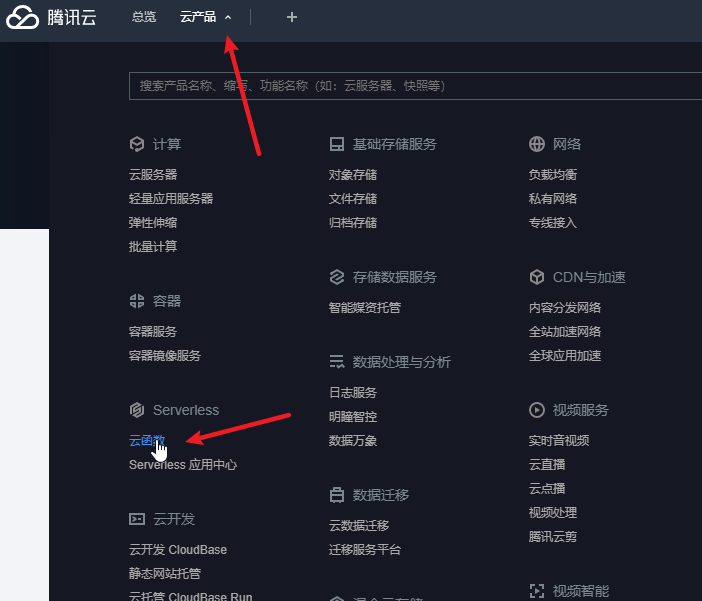
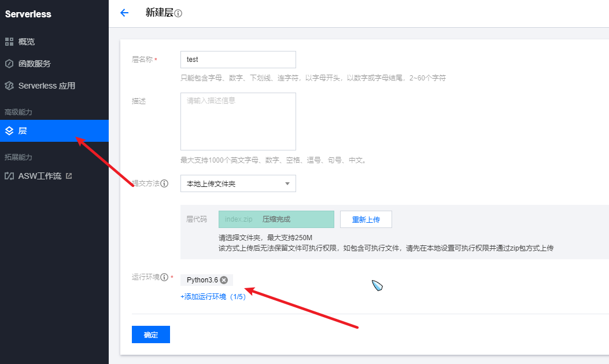
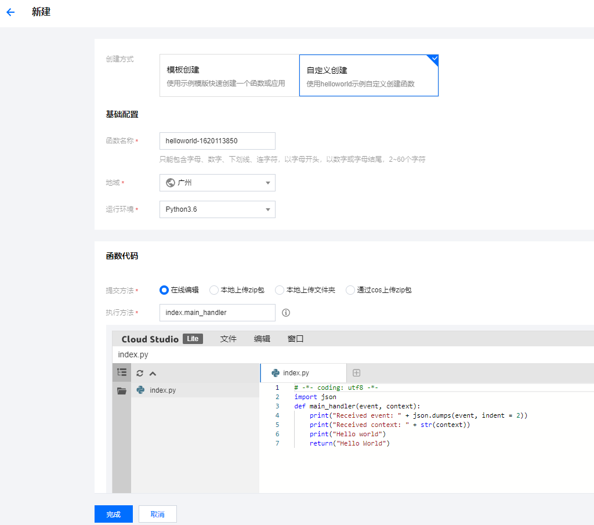
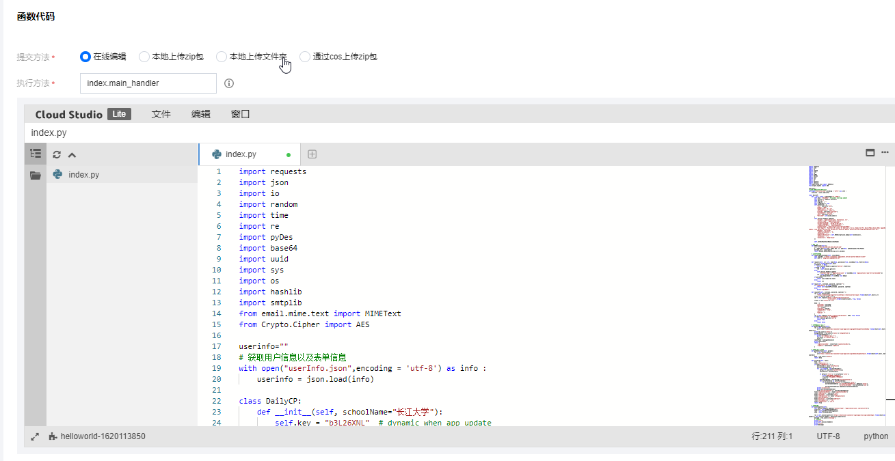
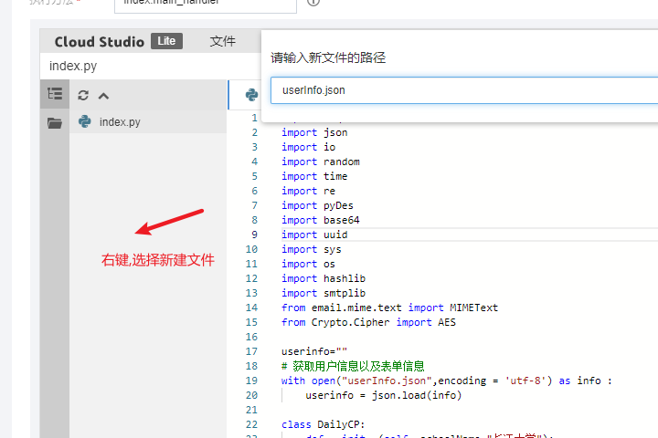
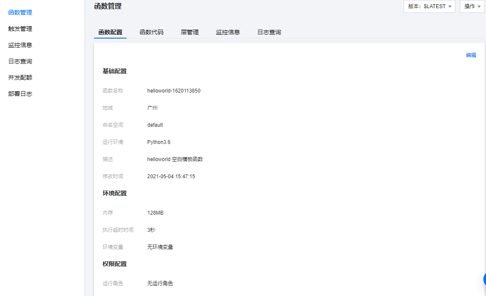
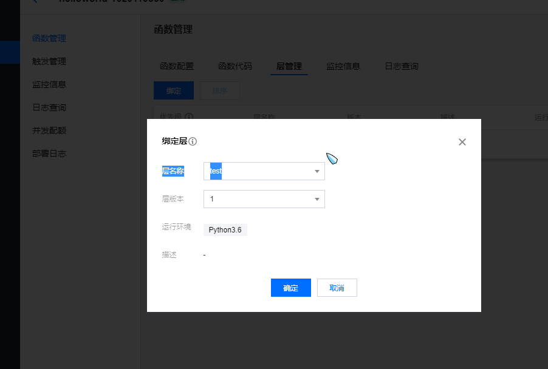
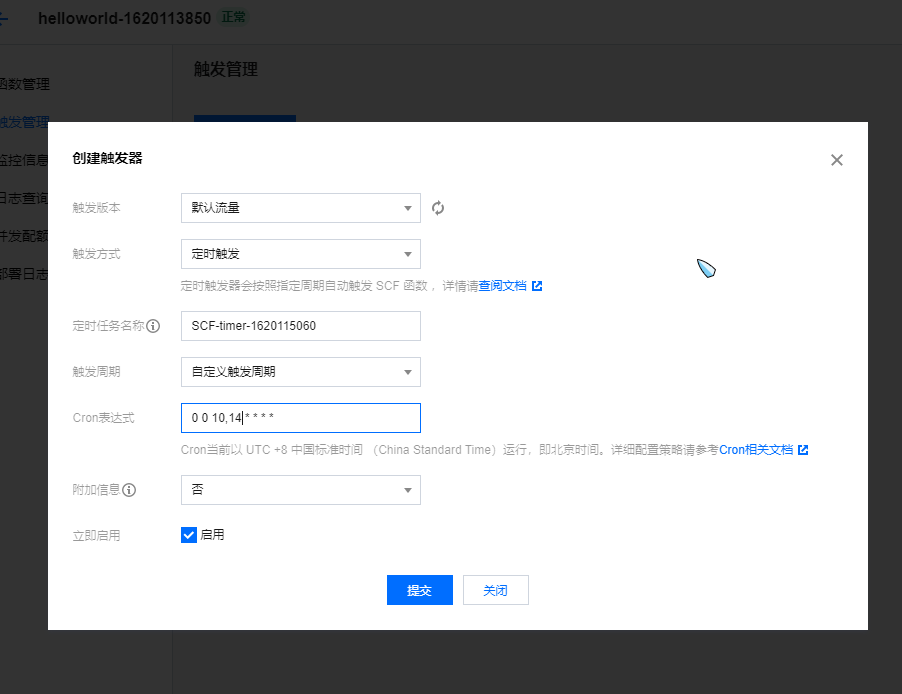

## 介绍

**通过[今日校园自动打卡项目](https://github.com/ZimoLoveShuang/auto-submit)二次开发而来.**
**通过[今日校园自动打卡项目](https://github.com/ZimoLoveShuang/auto-submit)二次开发而来.**
**通过[今日校园自动打卡项目](https://github.com/ZimoLoveShuang/auto-submit)二次开发而来.**


简化了原项目大部分代码,只保留了签到打卡等主要功能.

此版本为**长江大学**定制版
此版本为**长江大学**定制版
此版本为**长江大学**定制版


更改了 `def setHostBySchoolName(self, schoolName):`方法,将原先的自动获取学校地址,改为默认地址,减小了网络请求次数


## 使用须知

自行更改`userinfo.json`中相关信息

```json
{
    "schoolName":"长江大学",			  //学校名称				
    "username":"xxxxxxx",				//今日校园登录账号
    "password":"xxxxxxx",				//今日校园登录密码
    "address":"湖北省荆州市荆州区曲江路26",	//学校地址

    "lon备注":"你的经度 信息",
    "lon":"112.221609",

    "lat备注":"你的纬度 信息",
    "lat":"30.339948",
    
    "sender": "xxxx@qq.com",		//签到信息发送邮箱
    "receivers":"xxxx@qq.com",		//签到信息接受邮箱
    "smtp_server": "smtp.qq.com",	
    "pass_word": "*********",		//邮箱授权码
    
    
    //当前表单信息  {问题,选项啊ing}
    "matchForm" : [
                    {"title" : "你今天的体温是？", "value" : "35.9-37.2"}, 
                    {"title" : "你今天的身体状态是？", "value" : "健康无异常"},
                    {"title" : "今天是否在校？", "value" : "在校"},
                    {"title" : "当前是否就业？", "value" : "考公考编考研中"}
                    ]
}
```


## 腾讯云函数自动签到

1. 登录腾讯云,进入云函数

   
   
2. 新建一个层,并上传依赖,点击确定




3. 新建云函数,选择自定义




4. 将我们的`DailyCP.py`中的所有代码粘贴至函数中`index.py`中




5. 右键空白处新建名为`userInfo.json`文件,并将`userInfo.json`中的代码粘贴至此,修改为自己的信息.




6. 粘贴无误后,单机左下角完成,出现该界面




7. 点击层管理,绑定我们之前创建的层





8. 新建一个触发器,来帮我们自动触发该脚本




**接下来我们便可以通过邮箱的消息来查看是否打卡成功了,也可以手动调用该云函数.**


在这里也为原作者点个👍,该项目只是像原作进行学习,请勿盗用滥用.
在这里也为原作者点个👍,该项目只是像原作进行学习,请勿盗用滥用.
在这里也为原作者点个👍,该项目只是像原作进行学习,请勿盗用滥用.